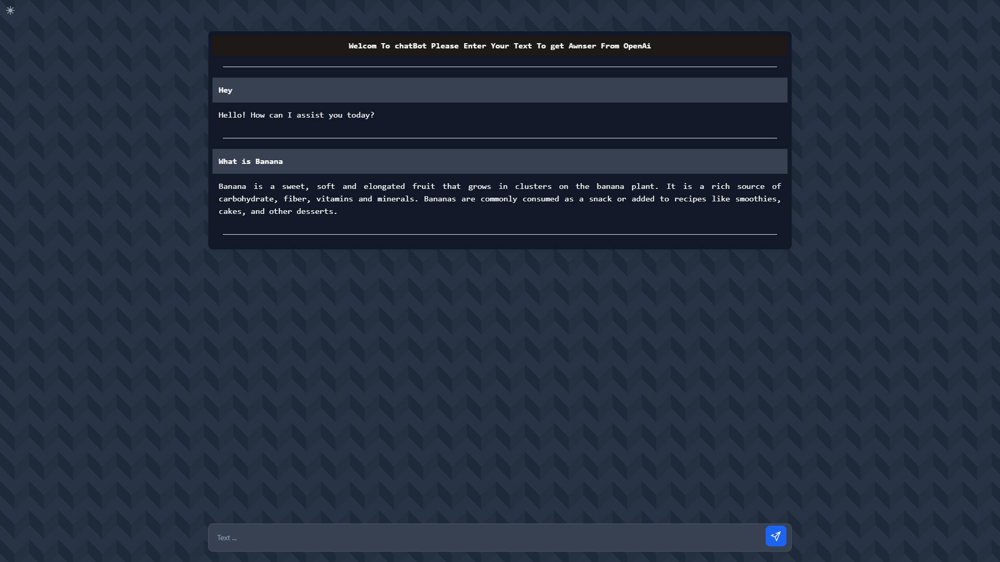

# chatbot-openai
## Chatbot with flask by connect to api OpenAi




### Run
- Set vatible in .env.example and rename it to .env

- Install docker and build Dockerfile
    ```
	docker build -t chatbot-flask .
    ```

- Run Image
    ```
	docker run chatbot-flask
    ```

